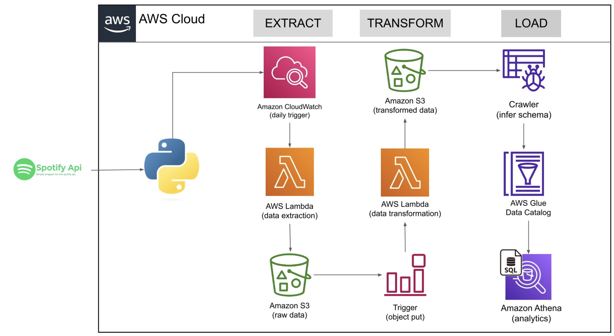

</head>
<body>
  <h1>Spotify End-to-End Pipeline</h1>

  <h2>Table of Contents</h2>
  <ul>
    <li><a href="#introduction">Introduction</a></li>
    <li><a href="#technologies-used">Technologies Used</a></li>
    <li><a href="#architecture">Architecture</a></li>
    <li><a href="#setup-and-configuration">Setup and Configuration</a></li>
    <li><a href="#usage">Usage</a></li>
    <li><a href="#contributing">Contributing</a></li>
    
  </ul>

  <h2 id="introduction">Introduction</h2>
  

    The Spotify End-to-End Pipeline is designed to extract data from Spotify using the Spotify API, transform it into a suitable format, and store it in a data lake for analysis. 
    The pipeline uses AWS services to create an automated workflow that handles data extraction, transformation, and storage efficiently.
    This pipeline provides a scalable and reliable solution for processing Spotify data and enabling data-driven decision making.
  

  <h2 id="technologies-used">Technologies Used</h2>
  

    The following technologies have been used in building this pipeline:
  

  <ul>
    <li>Spotify API: For accessing and retrieving data from Spotify.</li>
    <li>AWS S3: For storing raw and transformed data files.</li>
    <li>AWS Lambda: To run serverless functions for data extraction and transformation.</li>
    <li>AWS CloudWatch: For monitoring and triggering the Lambda functions based on specified events.</li>
    <li>AWS Athena: For querying and analyzing the transformed data using SQL.</li>
    <li>AWS Glue: For automating the ETL (Extract, Transform, Load) process and generating the required metadata.</li>
  </ul>

  <h2 id="architecture">Architecture</h2>
  

    The pipeline follows the below architecture:
  

  

  <ol>
    <li>Spotify data is extracted using the <code>extract.py</code> Lambda function, which utilizes the Spotify API to fetch the required data and store it in an S3 bucket.</li>
    <li>The <code>transform.py</code> Lambda function is triggered by CloudWatch Events and performs the necessary transformations on the extracted data. The transformed data is then stored in a different S3 bucket.</li>
    <li>AWS Glue is used to create a crawler that automatically discovers and catalogs the transformed data in the S3 bucket.</li>
    <li>AWS Athena is utilized to query the transformed data using SQL for further analysis and reporting.</li>
  </ol>

  <h2 id="setup-and-configuration">Setup and Configuration</h2>
  <ol>
    <li>Clone this repository to your local machine.</li>
    <li>Create an AWS account if you don't have one already.</li>
    <li>Set up the required AWS services:
      <ul>
        <li>Create S3 buckets for storing raw and transformed data.</li>
        <li>Create an IAM role with necessary permissions for Lambda, S3, CloudWatch, Athena, and Glue.</li>
        <li>Set up AWS Glue and create a crawler to discover and catalog the transformed data.</li>
        <li>Configure AWS Lambda functions <code>extract.py</code> and <code>transform.py</code> with the appropriate IAM role and trigger events.</li>
      </ul>
    </li>
    <li>Update the necessary configuration files and environment variables:
      <ul>
        <li>Update <code>config.py</code> with the required AWS service details, S3 bucket names, and other configuration parameters.</li>
        <li>Set up environment variables for API keys and credentials needed for Spotify data extraction.</li>
      </ul>
    </li>
    <li>Deploy the Lambda functions to AWS Lambda.</li>
    <li>Test the pipeline by invoking the Lambda functions or setting up CloudWatch Events to trigger the functions automatically.</li>
  </ol>

  <h2 id="usage">Usage</h2>
  <ol>
    <li>Ensure that the pipeline has been set up and configured correctly.</li>
    <li>Run the <code>extract.py</code> Lambda function manually or schedule it using CloudWatch Events to start the data extraction process from Spotify.</li>
    <li>The extracted data will be stored in the specified S3 bucket.</li>
    <li>The <code>transform.py</code> Lambda function will be triggered by CloudWatch Events to transform the extracted data and store it in a different S3 bucket.</li>
    <li>AWS Glue will automatically catalog the transformed data using a crawler.</li>
    <li>Use AWS Athena to query and analyze the transformed data using SQL queries.</li>
  </ol>

  <h2 id="contributing">Contributing</h2>
  

    Contributions to the Spotify End-to-End Pipeline are welcome! If you find any issues or want to enhance the pipeline, feel free to submit a pull request with your changes.
    Please ensure to follow the existing coding style and guidelines.
  

 
